# 利用神经网络对mushroom进行分类

### 一. 神经网络的搭建
1. 代价函数
- 二次代价函数:网络输出a和目标输出y的二次代价函数的直接计算结果。

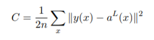

```python
class QuadraticCost(object):
    @staticmethod
    def fn(a, y):
        return 0.5*np.linalg.norm(a-y)**2
    @staticmethod
    def delta(z, a, y):
        return (a-y) * sigmoid_prime(z)
```
- 交叉熵代价函数:函数是非负的，在神经元达到很好的正确率的时候会接近零。输出激活值a和目标输出y差距优劣的度量。  

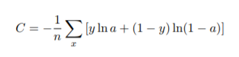

```python
class CrossEntropyCost(object):
    @staticmethod
    def fn(a, y):
        return np.sum(np.nan_to_num(-y*np.log(a)-(1-y)*np.log(1-a)))
    @staticmethod
    def delta(z, a, y):
        return (a-y)
```
2. 激活函数：激活函数使用sigmoid函数，下面是其计算和其导数的计算。

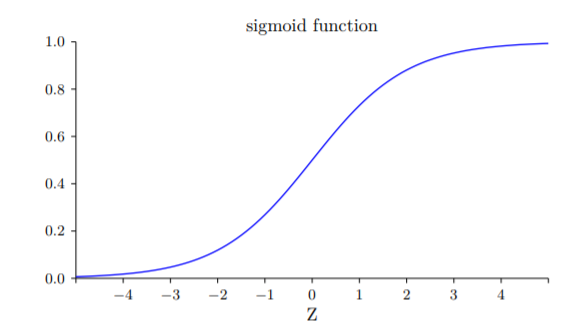

```python
def sigmoid(z):
    return 1.0/(1.0+np.exp(-z))

def sigmoid_prime(z):
    return sigmoid(z)*(1-sigmoid(z))
```
3. 神经网络类
    1. 初始化：传入sizes参数构建神经网络的全连接层，默认使用交叉熵代价函数和默认权重初始化。
    ```python
    def __init__(self, sizes, cost=CrossEntropyCost):
        self.num_layers = len(sizes)
        self.sizes = sizes
        self.default_weight_initializer()
        self.cost = cost
    ```
    2. 权重初始化：使用两种权重初始化方式，默认权重初始化为均值为0，标准差为1的高斯分布随机分布。第二种权重初始化为均值为0，标准差为`$\frac{1}{\sqrt{n}}$`，以此来避免隐藏神经元饱和。
    ```python
    def default_weight_initializer(self):
        self.biases = [np.random.randn(y, 1) for y in self.sizes[1:]]
        self.weights = [np.random.randn(y, x) for x, y in zip(self.sizes[:-1], self.sizes[1:])]
    def large_weight_initializer(self):
        self.biases = [np.random.randn(y, 1) for y in self.sizes[1:]]
        self.weights = [np.random.randn(y, x)/np.sqrt(x) for x, y in zip(self.sizes[:-1], self.sizes[1:])]
    ```
    3. 前馈函数：用于最后测试集用训练好的权重和偏置来计算网络输出。
    ```python
    def feedforward(self, a):
        for b, w in zip(self.biases, self.weights):
            a = sigmoid(np.dot(w, a)+b)
        return a
    ```
    4. 随机梯度下降：神经网络的核心。传入参数为{训练集，迭代期，小批量数据大小，学习率，正则化参数，测试集，四个检测数据}，最后返回四个参数值{evaluation_cost, evaluation_accuracy, training_cost, training_accuracy}以展示神经网络实现的效果。函数内部在每个迭代期将训练集随机打乱，将数据集分成很多个小批次，通过反向传播算法计算权重和偏置，在迭代期内不断更新训练神经网络。然后通过一些辅助函数来计算训练后的神经网络在测试集上的效果。
    ```python
    def SGD(self, training_data, epochs, mini_batch_size, eta, lmbda = 0.0, evaluation_data=None, monitor_evaluation_cost=False, monitor_evaluation_accuracy=False, monitor_training_cost=False, monitor_training_accuracy=False):
        if evaluation_data:
            n_data = len(evaluation_data)
        n = len(training_data)
        evaluation_cost, evaluation_accuracy = [], []
        training_cost, training_accuracy = [], []
        for j in range(epochs):
            random.shuffle(training_data)
            mini_batches = [
                training_data[k:k+mini_batch_size]
                for k in range(0, n, mini_batch_size)]
            for mini_batch in mini_batches:
                self.update_mini_batch(
                    mini_batch, eta, lmbda, len(training_data))
            print("Epoch %s training complete" % j)
            if monitor_evaluation_accuracy:
                accuracy = self.accuracy(evaluation_data)
                evaluation_accuracy.append(accuracy)
                print("Accuracy on evaluation data: {} / {}".format(
                    self.accuracy(evaluation_data), n_data))
        return accuracy
        # return evaluation_cost, evaluation_accuracy, training_cost, training_accuracy
    ```
    5. 辅助函数
        1. 更新小批次：在数据集的小批次训练权重和偏置，体现项目的模块化。
        ```python
        def update_mini_batch(self, mini_batch, eta, lmbda, n):
            nabla_b = [np.zeros(b.shape) for b in self.biases]
            nabla_w = [np.zeros(w.shape) for w in self.weights]
            for x, y in mini_batch:
                delta_nabla_b, delta_nabla_w = self.backprop(x, y)
                nabla_b = [nb+dnb for nb, dnb in zip(nabla_b, delta_nabla_b)]
                nabla_w = [nw+dnw for nw, dnw in zip(nabla_w, delta_nabla_w)]
            self.weights = [(1-eta*(lmbda/n))*w-(eta/len(mini_batch))*nw
                            for w, nw in zip(self.weights, nabla_w)]
            self.biases = [b-(eta/len(mini_batch))*nb
                           for b, nb in zip(self.biases, nabla_b)]
        ```
        2. 反向传播：主要是数学的实现，可以把他当做一个黑盒，具体参见教材[反向传播实现](http://neuralnetworksanddeeplearning.com/chap2.html)
        ```python
        def backprop(self, x, y):
            nabla_b = [np.zeros(b.shape) for b in self.biases]
            nabla_w = [np.zeros(w.shape) for w in self.weights]
            # feedforward
            activation = x
            activations = [x]
            zs = []
            for b, w in zip(self.biases, self.weights):
                z = np.dot(w, activation)+b
                zs.append(z)
                activation = sigmoid(z)
                activations.append(activation)
            # backward pass
            delta = (self.cost).delta(zs[-1], activations[-1], y)
            nabla_b[-1] = delta
            nabla_w[-1] = np.dot(delta, activations[-2].transpose())
            for l in range(2, self.num_layers):
                z = zs[-l]
                sp = sigmoid_prime(z)
                delta = np.dot(self.weights[-l+1].transpose(), delta) * sp
                nabla_b[-l] = delta
                nabla_w[-l] = np.dot(delta, activations[-l-1].transpose())
            return (nabla_b, nabla_w)
        ```
        3. 测试准确数目：判断网络输出和数据集相同的个数
        ```python
        def accuracy(self, data, convert=False):
            results = [(np.argmax(self.feedforward(x)), np.argmax(y))
                           for (x, y) in data]
            return sum(int(x == y) for (x, y) in results)
        ```
        4. 代价函数值：计算在数据集中的代价函数
        ```python
        def total_cost(self, data, lmbda, convert=False):
            cost = 0.0
            for x, y in data:
                a = self.feedforward(x)
                cost += self.cost.fn(a, y)/len(data)
            cost += 0.5*(lmbda/len(data))*sum(np.linalg.norm(w)**2 for w in self.weights)
            return cost
        ```
        5. 保存模型：把神经网络的结构，权重，偏置和代价函数保存到json文件里，供后面直接调用该模型。
        ```python
        def save(self, filename):
            data = {"sizes": self.sizes,
                    "weights": [w.tolist() for w in self.weights],
                    "biases": [b.tolist() for b in self.biases],
                    "cost": str(self.cost.__name__)}
            f = open(filename, "w")
            json.dump(data, f) #写入json文件
            f.close()
        ```
### 二. 数据集处理
查看mushroom.csv文件，该数据集处理的目标是根据22个特征预测蘑菇是否有毒。是否有毒根据数据数字化来看，0和1分别表示无毒和有毒。
1. 将字母处理为数字：直接调用sklearn库的preprocessing库，使用LabelEncoder将字母数字化，然后再用train_test_split方法分离测试集和训练集。
```python
# 读取数据并预处理
data = pd.read_csv('mushrooms.csv')
encoder = preprocessing.LabelEncoder()
for col in data.columns:
    data[col] = encoder.fit_transform(data[col])
data = np.array(data)
train, test = train_test_split(data, test_size = 0.4)
```
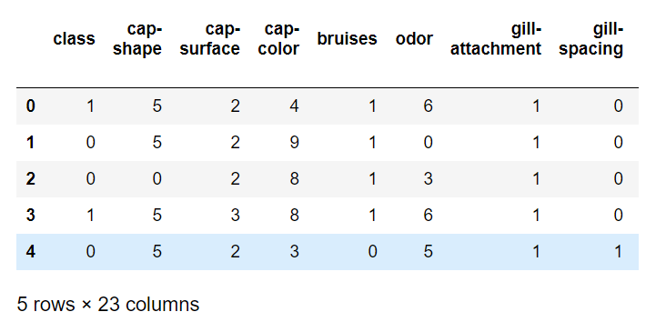

2. 调整格式：为了适应神经网络的结构，需要将数据集处理为元素为元组的列表的形式，元组的两个元素是输入层和输出层。输入是22行的列向量，输出是两行的列向量。
```python
train_out = [x[0] for x in train]
train_in = np.array([x[1:] for x in train]).astype('float')
test_out = [x[0] for x in test]
test_in = np.array([x[1:] for x in test]).astype('float')
# 向量化
train_outs = [vectorized(y) for y in train_out]
train_ins = [np.reshape(x, (22,1)) for x in train_in]
test_outs = [vectorized(y) for y in test_out]
test_ins = [np.reshape(x, (22,1)) for x in test_in]
train_datas = list(zip(train_ins, train_outs))
test_datas = list(zip(test_ins, test_outs))
```
### 三. 调参调优
控制变量，当比较某一参数时，将其他参数设置为最优情况时的数值。
```python
# 训练集：测试集 = 6：4
train_datas, test_datas = data.data_loader()
num_of_test = len(test_datas)
# 基础参数,下面的对比说明为什么选择这些作为基本参数
layers = [22,30,100,2]
epochs = 30
mini_batch = 10
eta = 0.5
lmbda = 5
```
1. 对比代价函数分别为交叉熵和二次代价函数时的两种情况
```python
def make_plot(epochs, ls1, ls2, label1, label2, title):
    fig, ax = plt.subplots()
    ax.plot(np.arange(1,epochs+1,1), ls1, 'rx--', color = '#2A6EA6', label = label1)
    ax.plot(np.arange(1,epochs+1,1), ls2, 'bo:', color = '#FFA933', label = label2)
    ax.set_xlabel('Epochs')
    ax.set_ylabel('Accuracy')
    ax.set_title(title)
    plt.legend(loc = 'best')
    plt.savefig(title)
    plt.show()
    # 对比1 分别使用交叉熵和二次代价函数
    def compare_cost():
    net1 = mynetwork.Network(layers, cost=mynetwork.QuadraticCost)
    net2 = mynetwork.Network(layers, cost=mynetwork.CrossEntropyCost)
    net1.large_weight_initializer()
    net2.large_weight_initializer()

    evaluation_accuracy1 = net1.SGD(train_datas, epochs, mini_batch, eta, evaluation_data = test_datas, \
              monitor_evaluation_accuracy = True)
    evaluation_accuracy2 = net2.SGD(train_datas, epochs, mini_batch, eta, evaluation_data = test_datas, \
              monitor_evaluation_accuracy = True)
    make_plot(epochs, evaluation_accuracy1, evaluation_accuracy2,\
              "Evaluation_accuracy_Quadratic", "Evaluation_accuracy_CrossEntropy",\
              "CompareofCost")
```
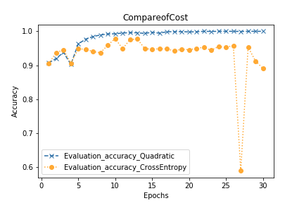

从图上可以看出，使用二次代价函数的效果远比交叉熵代价函数好得多，而且交叉熵函数随着迭代期的波动很大。和手写数字识别不同的是，mushroom数据集只是一个二分类问题，而且数据集较小，所以猜测交叉熵在mushroom数据集中没有起到作用，导致二次代价函数展现的效果比它要好。
2. 不同神经网络隐藏层设置对比
```python
def compare_layers():
    layers1 = [22,30,2]
    layers2 = [22,50,2]
    layers3 = [22,30,100,2]
    layers4 = [22,50,100,2]
    net1 = mynetwork.Network(layers1, cost=mynetwork.CrossEntropyCost)
    net2 = mynetwork.Network(layers2, cost=mynetwork.CrossEntropyCost)
    net3 = mynetwork.Network(layers3, cost=mynetwork.CrossEntropyCost)
    net4 = mynetwork.Network(layers4, cost=mynetwork.CrossEntropyCost)
    net1.large_weight_initializer()
    net2.large_weight_initializer()
    net3.large_weight_initializer()
    net4.large_weight_initializer()

    evaluation_accuracy1 = net1.SGD(train_datas, epochs, mini_batch, eta, evaluation_data = test_datas, \
              monitor_evaluation_accuracy = True)
    evaluation_accuracy2 = net2.SGD(train_datas, epochs, mini_batch, eta, evaluation_data = test_datas, \
              monitor_evaluation_accuracy = True)
    evaluation_accuracy3 = net3.SGD(train_datas, epochs, mini_batch, eta, evaluation_data = test_datas, \
              monitor_evaluation_accuracy = True)
    evaluation_accuracy4 = net4.SGD(train_datas, epochs, mini_batch, eta, evaluation_data = test_datas, \
              monitor_evaluation_accuracy = True)

    fig, ax = plt.subplots()
    ax.plot(np.arange(1,epochs+1,1), evaluation_accuracy1, 'x-', color='red', label = '[22,30,2]')
    ax.plot(np.arange(1,epochs+1,1), evaluation_accuracy2, 'o-', color='blue', label = '[22,50,2]')
    ax.plot(np.arange(1,epochs+1,1), evaluation_accuracy3, 'x-', color='green', label = '[22,30,100,2]')
    ax.plot(np.arange(1,epochs+1,1), evaluation_accuracy4, 'o-', color='yellow', label = '[22,50,100,2]')
    ax.set_xlim([1,31])
    ax.set_xlabel('Epochs')
    ax.set_ylabel('Accuracy')
    ax.set_title('CompareofLayers')
    plt.legend(loc='best')
    plt.savefig('CompareofLayers')
    plt.show()
```

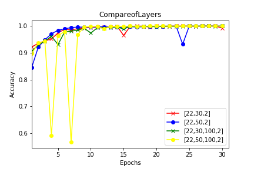
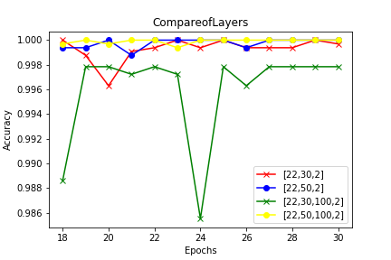

从图上可以看出，在代价函数为二次代价函数的情况下，隐藏层的结构对网络的准确率影响并不大，放大来看局部图,当隐藏层层数为两层且隐藏神经元较多时准确率更大些，选取为[22,50,100,2]。
3. 不同的小批次大小对比
```python
def compare_mini_batch():
    batch1 = 10
    batch2 = 20
    batch3 = 100
    batch4 = 5
    net1 = mynetwork.Network(layers, cost=mynetwork.QuadraticCost)
    net2 = mynetwork.Network(layers, cost=mynetwork.QuadraticCost)
    net3 = mynetwork.Network(layers, cost=mynetwork.QuadraticCost)
    net4 = mynetwork.Network(layers, cost=mynetwork.QuadraticCost)
    net1.large_weight_initializer()
    net2.large_weight_initializer()
    net3.large_weight_initializer()
    net4.large_weight_initializer()

    evaluation_accuracy1 = net1.SGD(train_datas, epochs, batch1, eta, evaluation_data = test_datas, \
              monitor_evaluation_accuracy = True)
    evaluation_accuracy2 = net2.SGD(train_datas, epochs, batch2, eta, evaluation_data = test_datas, \
              monitor_evaluation_accuracy = True)
    evaluation_accuracy3 = net3.SGD(train_datas, epochs, batch3, eta, evaluation_data = test_datas, \
              monitor_evaluation_accuracy = True)
    evaluation_accuracy4 = net3.SGD(train_datas, epochs, batch4, eta, evaluation_data = test_datas, \
              monitor_evaluation_accuracy = True)

    fig, ax = plt.subplots()
    ax.plot(np.arange(1,epochs+1,1), evaluation_accuracy1, 'x-', color='red', label = 'mini_batch=10')
    ax.plot(np.arange(1,epochs+1,1), evaluation_accuracy2, 'o-', color='blue', label = 'mini_batch=20')
    ax.plot(np.arange(1,epochs+1,1), evaluation_accuracy3, 'x-', color='green', label = 'mini_batch=100')
    ax.plot(np.arange(1,epochs+1,1), evaluation_accuracy2, 'o-', color='black', label = 'mini_batch=5')

    ax.set_xlim([1,31])
    ax.set_xlabel('Epochs')
    ax.set_ylabel('Accuracy')
    ax.set_title('CompareofMinibatch')
    plt.legend(loc='best')
    plt.savefig('CompareofMinibatch')
    plt.show()
```

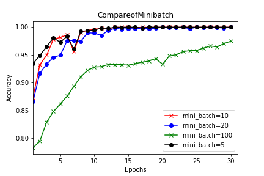

从图上可以看出，mini_batch为100时准确率明显低于10，而mini_batch为5,10,20时，准确率相差不大，所以mini_batch太大会非常影响神经网络的训练效果，选择mini_batch为10。
4. 不同学习率对比
```python
def compare_eta():
    eta1 = 0.05
    eta2 = 0.5
    eta3 = 10
    eta4 = 50
    net1 = mynetwork.Network(layers, cost=mynetwork.QuadraticCost)
    net2 = mynetwork.Network(layers, cost=mynetwork.QuadraticCost)
    net3 = mynetwork.Network(layers, cost=mynetwork.QuadraticCost)
    net4 = mynetwork.Network(layers, cost=mynetwork.QuadraticCost)
    net1.large_weight_initializer()
    net2.large_weight_initializer()
    net3.large_weight_initializer()
    net4.large_weight_initializer()
    
    evaluation_accuracy1 = net1.SGD(train_datas, epochs, mini_batch, eta1, evaluation_data = test_datas, \
              monitor_evaluation_accuracy = True)
    evaluation_accuracy2 = net2.SGD(train_datas, epochs, mini_batch, eta2, evaluation_data = test_datas, \
              monitor_evaluation_accuracy = True)
    evaluation_accuracy3 = net3.SGD(train_datas, epochs, mini_batch, eta3, evaluation_data = test_datas, \
              monitor_evaluation_accuracy = True)
    evaluation_accuracy4 = net3.SGD(train_datas, epochs, mini_batch, eta4, evaluation_data = test_datas, \
              monitor_evaluation_accuracy = True)
    
    fig, ax = plt.subplots()
    ax.plot(np.arange(1,epochs+1,1), evaluation_accuracy1, 'x-', color='red', label = 'eta=0.05')
    ax.plot(np.arange(1,epochs+1,1), evaluation_accuracy2, 'x-', color='red', label = 'eta=0.5')
    ax.plot(np.arange(1,epochs+1,1), evaluation_accuracy3, 'x-', color='green', label = 'eta=10')
    ax.plot(np.arange(1,epochs+1,1), evaluation_accuracy2, 'o-', color='yellow', label = 'eta=50')
    
    ax.set_xlim([1,31])
    ax.set_xlabel('Epochs')
    ax.set_ylabel('Accuracy')
    ax.set_title('CompareofEta')
    plt.legend(loc='best')
    plt.savefig('CompareofEta')
    plt.show()
```
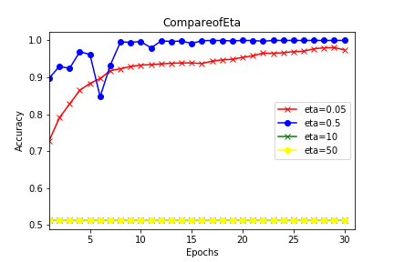

从图上可以看出，学习率为10和50时准确率并没有上升的意思，而学习率太小0.05准确率没有0.5高，设置学习率为0.5。

5. 不同正则化参数对比
```python
def compare_lmbda():
    lmbda1 = 0.1
    lmbda2 = 0.5
    lmbda3 = 5
    lmbda4 = 50
    net1 = mynetwork.Network(layers, cost=mynetwork.QuadraticCost)
    net2 = mynetwork.Network(layers, cost=mynetwork.QuadraticCost)
    net3 = mynetwork.Network(layers, cost=mynetwork.QuadraticCost)
    net4 = mynetwork.Network(layers, cost=mynetwork.QuadraticCost)
    net1.large_weight_initializer()
    net2.large_weight_initializer()
    net3.large_weight_initializer()
    net4.large_weight_initializer()
    
    evaluation_accuracy1 = net1.SGD(train_datas, epochs, mini_batch, eta, lmbda = lmbda1, evaluation_data = test_datas, \
      monitor_evaluation_accuracy = True)
    evaluation_accuracy2 = net2.SGD(train_datas, epochs, mini_batch, eta, lmbda = lmbda2, evaluation_data = test_datas, \
      monitor_evaluation_accuracy = True)
    evaluation_accuracy3 = net3.SGD(train_datas, epochs, mini_batch, eta, lmbda = lmbda3, evaluation_data = test_datas, \
      monitor_evaluation_accuracy = True)
    evaluation_accuracy4 = net3.SGD(train_datas, epochs, mini_batch, eta, lmbda = lmbda4, evaluation_data = test_datas, \
      monitor_evaluation_accuracy = True)
    
    fig, ax = plt.subplots()
    ax.plot(np.arange(1,epochs+1,1), evaluation_accuracy1, 'x-', color='red', label = 'lmbda=0.1')
    ax.plot(np.arange(1,epochs+1,1), evaluation_accuracy2, 'o-', color='red', label = 'lmbda=0.5')
    ax.plot(np.arange(1,epochs+1,1), evaluation_accuracy3, 'x-', color='green', label = 'lmbda=5')
    ax.plot(np.arange(1,epochs+1,1), evaluation_accuracy2, 'o-', color='yellow', label = 'lmbda=50')
    
    ax.set_xlim([1,31])
    ax.set_xlabel('Epochs')
    ax.set_ylabel('Accuracy')
    ax.set_title('Compareoflmbda')
    plt.legend(loc='best')
    plt.savefig('Compareoflmbda')
    plt.show()
```

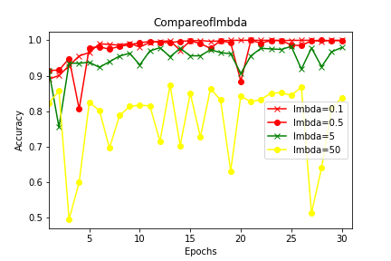

从图中可以看出，正则化参数越高准确率越低，主要是因为数据集太小的原因。设置正则化参数为0.1。
### 四.最优神经网络
```python
net_one = mynetwork.Network(layers, cost=mynetwork.QuadraticCost)
net_one.large_weight_initializer()
accuracy = net_one.SGD(train_datas, epochs, mini_batch, eta, evaluation_data = test_datas,monitor_evaluation_accuracy = True)
```

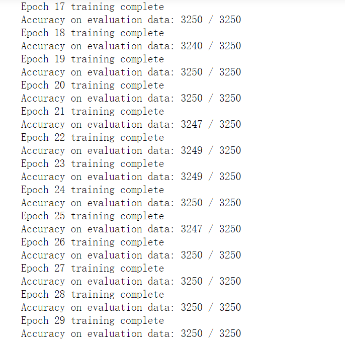

### 666666
